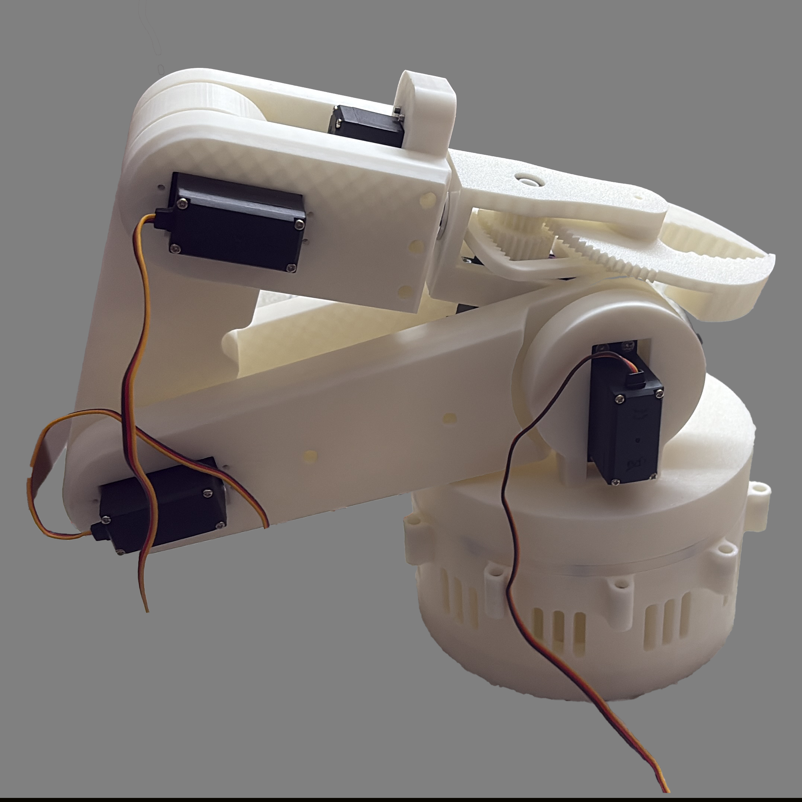
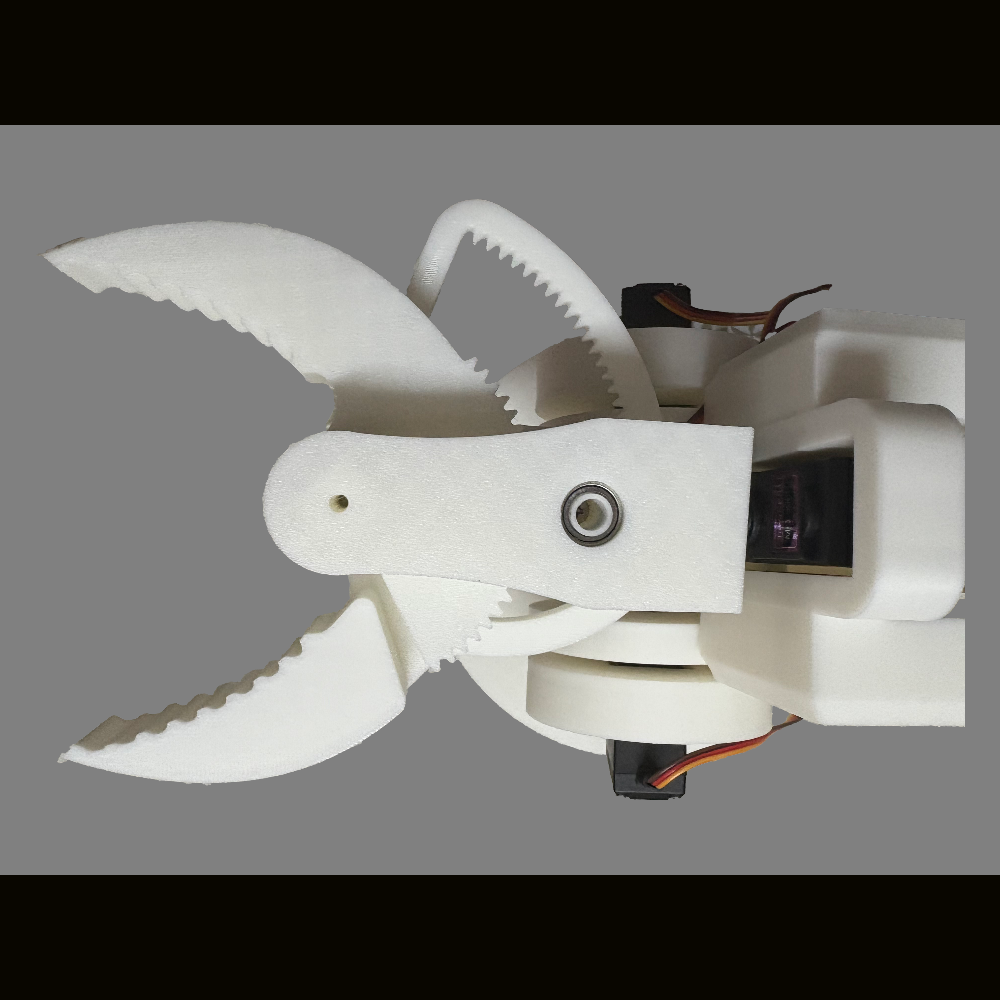

# TeleOp System

A monocular camera-based teleoperation system for controlling a 5-DOF robotic arm using hand pose estimation and depth sensing. The operator's arm movements, captured by a webcam or iPhone, are mapped in real time to joint angles on either a physical robot (Arduino + servos) or a MuJoCo physics simulation.

| Robotic Arm | Gripper |
|:-----------:|:-------:|
|  |  |

---

## How It Works

```
Camera (webcam / iPhone / video file)
  ↓
Depth Estimation  →  estimates metric 3D depth per pixel
  ↓
Pose Tracking     →  MediaPipe extracts shoulder / elbow / wrist 2D keypoints
                     combined with depth → 3D XYZ positions
  ↓
IK Solver         →  converts 3D wrist/elbow/shoulder positions to 5 joint angles
  ↓
Output
  ├── MuJoCo simulation  (visual feedback)
  └── Arduino serial     (real hardware: PCA9685 servos + A4988 stepper)
```

---

## Repository Layout

```
teleop_system/
├── src/                        # Core Python source
│   ├── main.py                 # Entry point — orchestrates the full pipeline
│   ├── depth_estimator.py      # Camera capture + depth inference backend
│   ├── pose_estimator.py       # MediaPipe pose + hand tracking; 2D→3D lift
│   ├── ik_mapper.py            # 5-DOF inverse kinematics solver
│   ├── sim_controller.py       # MuJoCo scene interface (joint angles, gripper)
│   ├── ard_controller.py       # Arduino serial handler (115200 baud)
│   ├── stereo_iphone.py        # TCP receiver for iPhone stereo depth (SGBM)
│   ├── iphone_source.py        # Record3D LiDAR streaming interface
│   ├── gesture_model.py        # TFLite keypoint classifier for hand gestures
│   ├── replay_bundle.py        # Offline replay from precomputed .npz bundles
│   ├── precompute_assets.py    # Offline tool: video → depth+pose bundle
│   ├── debug_visuals.py        # OpenCV debug panel rendering
│   └── cv_display.py           # Multiprocessing OpenCV display worker
│
├── config/
│   ├── robot_kinematics.yaml   # Link lengths, joint limits, camera→base transform
│   └── stereo_iphone_calib.npz # Stereo calibration output (generated by script)
│
├── models/
│   ├── scene_teleop.xml                # MuJoCo scene (table + 5-DOF arm + workspace)
│   ├── five_dof_robot.xml              # Standalone arm MJCF
│   ├── keypoint_classifier.tflite      # Pre-trained gesture model (kinivi)
│   └── keypoint_classifier_label.csv   # Gesture class labels
│
├── arduino/
│   └── teleop_receiver.ino     # Arduino firmware: parses serial commands,
│                               # drives PCA9685 servos and A4988 stepper
│
├── scripts/
│   ├── calib_stereo_iphone.py  # Stereo calibration: checkerboard → K, R, T, baseline
│   ├── calib_checkerboard.py   # Monocular checkerboard detection helper
│   └── smoke_benchmark.py      # Depth/pose inference profiler
│
├── ios_streamer/               # Swift iOS app (MultiCamStreamer) for stereo streaming
│                               # wide + telephoto cameras → TCP to host
│
├── third_party/
│   └── Depth-Anything-V2/      # Optional: local clone for offline PyTorch weights
│
├── videos/                     # Test video clips
└── requirements.txt
```

---

## Source File Reference

| File | What it does |
|------|-------------|
| `src/main.py` | Parses CLI args, initialises all components, runs the frame loop |
| `src/depth_estimator.py` | Wraps Depth Anything V2, Depth Pro, Record3D LiDAR, and stereo SGBM behind a single interface; runs depth inference on a background thread |
| `src/pose_estimator.py` | Runs MediaPipe Pose + Hand landmarkers; projects 2D keypoints to 3D using the depth map; detects pinch and fist gestures |
| `src/ik_mapper.py` | Geometric 5-DOF IK: shoulder pitch, elbow pitch, base yaw, wrist pitch, gripper roll; enforces joint limits and Z-floor clamping from `robot_kinematics.yaml` |
| `src/sim_controller.py` | Sets MuJoCo joint angles each frame, updates the gripper visual and goal sphere |
| `src/ard_controller.py` | Auto-detects Arduino on `/dev/cu.usbmodem*`; formats and writes `H hx hy hz roll grip base` commands at 115200 baud |
| `src/stereo_iphone.py` | TCP client for the MultiCamStreamer iOS app; decodes wide + telephoto JPEG frames and computes disparity via OpenCV SGBM |
| `src/iphone_source.py` | Interfaces with the Record3D library for iPhone 16 Pro LiDAR; provides RGB + metric depth frames |
| `src/gesture_model.py` | Loads the TFLite keypoint classifier; normalises 21 hand landmarks and returns a gesture label |
| `src/replay_bundle.py` | Reads precomputed `.npz` bundles (depth maps + pose keypoints) for offline replay without live inference |
| `src/precompute_assets.py` | Processes a video file through the depth + pose pipeline and saves the result as a `.npz` bundle |
| `src/debug_visuals.py` | Builds the two-panel OpenCV debug image (pose overlay left, depth colormap right) |
| `src/cv_display.py` | Spawned subprocess that owns the OpenCV `imshow` window, receiving JPEG frames via a queue to avoid blocking the main thread |

---

## Depth Backends

| Backend | Flag | Notes |
|---------|------|-------|
| Depth Anything V2 (HuggingFace) | `--depth-model depth_anything` | Default; ~100 ms on Apple M-series MPS |
| Depth Anything V2 (local PyTorch) | `--depth-da-pth /path/to/weights.pth` | Faster; needs the `.pth` weights file |
| Apple Depth Pro | `--depth-model depth_pro --depth-checkpoint /path/to/depth_pro.pt` | Most accurate; ~500 ms; install separately |
| iPhone 16 Pro LiDAR | `--iphone-depth` | Ground-truth metric depth; requires Record3D app |
| iPhone stereo (SGBM) | `--stereo-iphone --iphone-ip <ip>` | Wide + telephoto; requires calibration first |

---

## Robot Configuration (`config/robot_kinematics.yaml`)

Tune this file to match your physical arm before running on hardware.

**Link lengths** — distance between adjacent joints:
- `L1 = 0.12 m` — base riser (base → shoulder)
- `L2 = 0.22 m` — upper arm (shoulder → elbow)
- `L3 = 0.22 m` — forearm (elbow → wrist)
- `L4 = 0.06 m` — wrist + gripper

**Joint limits:**

| Joint | Name | Range | Purpose |
|-------|------|-------|---------|
| J1 | `base_z` | −120° → +120° | Horizontal yaw |
| J2 | `shoulder_y` | −30° → +120° | Arm elevation (pitch) |
| J3 | `elbow_y` | −150° → +10° | Forearm bend (pitch) |
| J4 | `wrist_y` | −120° → +120° | Wrist up/down (pitch) |
| J5 | `gripper_x` | −180° → +180° | Forearm roll |

**Safety:** wrist is clamped to ≥ 5 cm above the table; reach is capped at 0.44 m to avoid singularities.

---

## Hardware Setup

### Arduino (`arduino/teleop_receiver.ino`)

Flash onto any Arduino (Uno tested). Wiring:
- **PCA9685** (I²C) → drives 6 MG996R continuous-rotation servos on channels 0–5:
  - Ch 0–1: Shoulder pair
  - Ch 2: Elbow
  - Ch 3: Wrist-Y
  - Ch 4: Wrist-X (roll)
  - Ch 5: Gripper
- **A4988 stepper driver** → NEMA17 motor for base yaw (1/16 microstep, 1.8°/step)

Serial command format (newline-terminated):
```
H hx hy hz roll grip base
```
All values are normalised to `[−1, 1]`.

---

## Installation

```bash
pip install -r requirements.txt

# Optional — Apple Depth Pro (accurate monocular depth)
git clone https://github.com/apple/ml-depth-pro
pip install -e ml-depth-pro

# Optional — iPhone LiDAR
pip install record3d

# Optional — TFLite gesture classifier
pip install tensorflow
```

> **MuJoCo note:** use `mjpython` (not `python`) as the interpreter on macOS to satisfy the Cocoa main-thread requirement.

---

## Running

### Simulation (no hardware needed)

```bash
# Default: built-in webcam + Depth Anything V2 + IK control
mjpython -m src.main --mode sim --show-cv

# Use a local .pth weights file (faster than HuggingFace download)
mjpython -m src.main --mode sim --depth-da-pth /path/to/depth_anything_v2_vits.pth --show-cv

# Hand-only control (no full-arm IK)
mjpython -m src.main --mode sim --hand-only-control --show-cv

# Playback a prerecorded video
mjpython -m src.main --mode sim --video videos/clip.mov --show-cv
```

### Real Hardware

```bash
# Auto-detects Arduino on /dev/cu.usbmodem*
mjpython -m src.main --mode real --show-cv

# Override serial port glob if needed
mjpython -m src.main --mode real --serial-pattern "cu.usbserial*" --show-cv
```

### iPhone Depth (LiDAR)

```bash
# Requires iPhone 16 Pro running Record3D with USB Streaming enabled
mjpython -m src.main --mode sim --iphone-depth --show-cv
```

### iPhone Stereo (wide + telephoto)

```bash
# Step 1: calibrate once (point a checkerboard at the phone)
python scripts/calib_stereo_iphone.py \
    --iphone-ip 192.168.1.42 \
    --board-cols 9 --board-rows 6 --square-mm 25

# Step 2: run with calibration
mjpython -m src.main --mode sim \
    --stereo-iphone --iphone-ip 192.168.1.42 \
    --stereo-calib config/stereo_iphone_calib.npz --show-cv
```

### Gesture Control

```bash
mjpython -m src.main --mode sim \
    --gesture-control \
    --gesture-model models/keypoint_classifier.tflite \
    --gesture-labels models/keypoint_classifier_label.csv --show-cv
```

### Precompute Offline Bundle (replay without live inference)

```bash
# Process video → save depth + pose bundle
python -m src.precompute_assets \
    --video videos/clip.mov \
    --depth-checkpoint /path/to/depth_pro.pt \
    --out bundle.npz

# Replay the bundle
mjpython -m src.main --mode sim --replay-bundle bundle.npz --show-cv
```

---

## Key CLI Flags

| Flag | Default | Description |
|------|---------|-------------|
| `--mode {sim\|real}` | `sim` | Simulation or real hardware |
| `--camera N` | `0` | Camera index or RTSP/MJPEG URL |
| `--video PATH` | — | Use a video file instead of live camera |
| `--replay-bundle PATH` | — | Replay from precomputed `.npz` |
| `--iphone-depth` | off | iPhone 16 Pro LiDAR via Record3D |
| `--stereo-iphone` | off | iPhone stereo via MultiCamStreamer |
| `--iphone-ip IP` | — | iPhone IP for stereo mode |
| `--stereo-calib PATH` | — | Stereo calibration `.npz` |
| `--depth-model {depth_anything\|depth_pro\|none}` | `depth_anything` | Depth backend |
| `--depth-checkpoint PATH` | — | Checkpoint for Depth Pro |
| `--depth-da-pth PATH` | — | Local `.pth` for Depth Anything V2 |
| `--depth-device {cpu\|mps\|cuda}` | auto | Inference device |
| `--hand-only-control` | off | Use hand landmarks only (no full arm IK) |
| `--gesture-control` | off | TFLite gesture classifier mode |
| `--gesture-model PATH` | — | TFLite model file |
| `--gesture-labels PATH` | — | Label CSV for gesture model |
| `--show-cv` | off | Show pose + depth debug panel |
| `--no-viewer` | off | Run MuJoCo headless |
| `--target-fps N` | 5 | Target frame rate |
| `--landmark-smooth F` | `0.25` | EMA smoothing weight on joint positions |
| `--no-arduino` | off | Skip Arduino connection |
| `--serial-pattern GLOB` | `cu.usbmodem*` | Serial port glob |

---

## Debug Display (`--show-cv`)

The OpenCV window shows two panels side by side:

- **Left:** RGB frame with MediaPipe pose skeleton (blue: shoulder→elbow→wrist) and hand landmarks (yellow)
- **Right:** Depth map colourised with the magma colourmap (purple = near, yellow = far)

Overlaid text shows: control mode, geometry validity, pinch/fist state, depth freshness.

---

## Performance Notes

| Backend | Approx. latency | Notes |
|---------|----------------|-------|
| Depth Anything V2 (MPS) | ~100 ms | Best for live control on Mac |
| Depth Pro (MPS) | ~500 ms | Better accuracy; use for offline bundles |
| iPhone LiDAR | ~30 ms | Ground truth; no monocular estimation |
| Stereo SGBM | ~20 ms | Requires calibration; CPU-only |

Full pipeline runs at 1–5 Hz end-to-end on Apple M-series. Lower `--target-fps` to give each frame more processing time.

---

## Troubleshooting

| Symptom | Fix |
|---------|-----|
| No depth output | Check `--depth-model` and that checkpoint paths exist |
| Arduino not found | Run `ls /dev/cu.*` and pass the correct `--serial-pattern` |
| High latency | Lower `--target-fps`, disable `--show-cv`, use LiDAR if available |
| Arm snaps on occlusion | Landmarks lost; `--landmark-smooth` raises inertia |
| MuJoCo crashes on launch | Use `mjpython`, not `python` |
